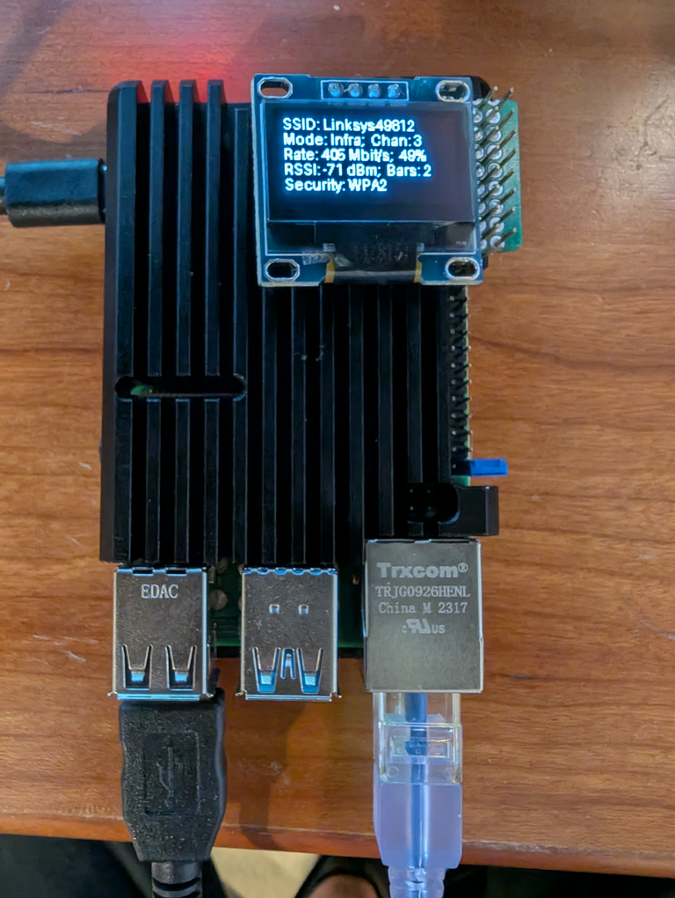

# HeadlessRasPi
WiFi Provisioning and System Status Display for Headless Raspberry Pi

This repo provides headless Raspberry Pi systems with a means of provisioning
the device's WiFi connection and displaying information about the system on a
small display attached to the Raspberry Pi's 40-pin connector.

## Mini-Display Page Examples

**TODO**
* Add option for another GPIO pin switch to trigger the display
* Describe what happens when you mis-provision the WiFi
* Describe how to configure Comitup

## Provisioning WiFi

WiFi provisioning is done with the Comitup package (https://davesteele.github.io/comitup/).
If a valid WiFi configuration exists on the RasPi, it will be uses to make a
WiFi connection to the specified Access Point (AP). If a connection cannot be
made, this package puts the device into AP mode and offers a web page that
allows the desired AP to be selected from a list the available APs, takes a
passphrase, and tries to set up a WiFi connection.  If it fails (e.g., due to
incorrect passphrase), the device will **????**

At any time while the device is running, if pins 39 and 40 (the bottom row of
pins closest to the device's RJ45 connector) are shorted for three seconds or
more, the device will flush any existing WiFi configuration information and
blink the green LED at the top of the device. The green LED flashes three
times to indicate that the WiFi information has been flushed and the device
will return to AP mode and another attempt can be made at WiFi provisioning.

## Displaying System Information

In order to debug headless RasPi devices, it is sometimes useful to have a
small display that shows important system information. To this end, this repo
includes code that enables a small display (e.g., a common I2C-connected 0.96"
OLED display) to be attached to the device's 40-pin connector and display the
desired system information upon defined device state changes.

A simple python framework is defined that allows a number of "Pages" (and,
optionally, subpages) of information to be displayed at different times to
help understand what is going on with the device.

The display of information is triggered by a script (i.e.,
`scripts/90wifi-state-change.sh`) that is called by the NetworkManager on WiFi
subsystem state changes.

This repo currently includes a single instance of a system information
display app (i.e., `src/infoDisplay.py`), which provides four Pages that
provide information on WiFi, WiFi Connections, CPU, and Memory subsystems.

### WiFi Page

The WiFi Page indicates if the WiFi radio is enabled, the state of the WiFi
connection process, the mode that the WiFi is currently in (i.e., AP or STA),
and the WiFi's MAC address. If the WiFi is connected to an AP, then it also
shows the AP's SSID, and the connection's IP address, WPA state, frequency,
and WiFi generation number.

### Access Points Page

The WiFi APs Page displays information about all of the APs that the device can
see, with one AP per subpage. Each subpage includes and indication of whether
the device is connected to the AP, the AP's name, SSID, mode of operation,
channel, signal strength (%), and number of bars (0-4). If the device is
currently connected to the AP, the page also include the data rate, RSSI, and
security method for the connection.

### CPU Page

The CPU Page displays the current CPU temperature, the amount of time elapsed
since the device last rebooted, and the device's current load average.

### Memory Page

The Memory Page shows the available, used, and total primary memory, as well as
the current utilization of the flash storage subsystem.

## Raspberry Pi Bookworm OS Patch

The repo also contains a fix to a known WiFi problem with Bookworm that
manifests itself in slow WiFi state transitions and lots of chatter in the
system's logs. The errors can be seen with `journalctl -t kernel`

Issue this command to disable the feature causing WiFi problems:
`sudo mv brcmfmac.conf /etc/modprobe.d/brcmfmac.conf`

# Configuration

## Software Setup

### WiFi Provisioning SW Setup

* install Comitup
  - `sudo apt install comitup`
    * alternatively, build and install it from the github repo
      - https://github.com/davesteele/comitup

* patch NetworkManager.py
  - need to patch the python network manager
    * `sudo cp /usr/lib/python3/dist-packages/NetworkManager.py /usr/lib/python3/dist-packages/NetworkManager.py.orig`
    * `sudo patch < conf/NetworkManager.patch`

* configure Comitup
  - **????**
  - modify the configuration defined in the /etc/comitup.conf file
    * enable flushing the credentials with `enable_nuke: 1`
    * can also set `verbose: <n>` if you want logs in `/var/log/comitup.log` and `/var/log/comitup-web.log`

* notes
  - the comitup utility writes connection files to /etc/NetworkManager/system-connections/
    * `comitup-<num>-<num'>.nmconnection`: the 10.41.0.1 config address
      - [connection]->autoconnect flag set to `false`
      - [ipv4]->method = manual
    * `<SSID>.nmconnection`: the connection that was provisioned via the web interface
      - this should be chmod 600
      - this does not have the [connection]->autoconnect flag set to `true`
        * it doesn't exist at all in this file
      - [ipv4]->method = `auto`

### Mini-Display SW Setup

* enable I2C on RasPi
  - `sudo raspi-config`
    * Interface Options -> I2C: `enable`
  - reboot RasPi

* install Python libraries in a venv
  - `sudo apt install virtualenvwrapper python3-virtualenvwrapper`
  - `echo "export WORKON_HOME=$HOME/.virtualenvs" >> ~/.bashrc`
  - `echo "export VIRTUALENVWRAPPER_PYTHON=/usr/bin/python" >> ~/.bashrc`
  - `echo "source /usr/share/virtualenvwrapper/virtualenvwrapper.sh" >> ~/.bashrc`
  - `mkvirtualenv --python=`which python3` --prompt=wifi WIFI`
  - `workon WIFI`
  - `pip3 install -r requirements`

* configure system to activate information display when the WiFi subsystem's state changes
  - `sudo cp ${HOME}/Code/HeadlessRasPi/scripts/wifiStateChange.sh /etc/NetworkManager/dispatcher.d/90wifi-state-change.sh`
  - `sudo chmod +x /etc/NetworkManager/dispatcher.d/90wifi-state-change.sh`

* notes
  - currently using the default font: six lines (with one or two lines of spacing) and 20 characters
    * can use a different font if it makes sense later
    * individual pages can use their own fonts
  - if the display SW is installed and no display is attached, then a message will be logged
    * the log is tagged with "systemDisplay" and is visible with `journalctl -t systemDisplay`
    * the system display SW does not check if a device is connected and will fail if run without a display (or if the display is disconnected while it is running)
  - the contents of the pages (and subpages) displayed, as well as the ordering and the amount of time each page is displayed, is configurable by editing the application -- alternatively, a whole new app can be written that shows different information alltogether.

## Mini-Display Hardware Setup

Currently, the information display package assumes the use of a common,
low-cost, SSD1306-controller-based, 128x64, monochrome, OLED display, with an
I2C interface.

### Attach OLED display

Only four connections to the RasPi 40-pin connector are needed.

* Connections:
  - `SDA`: GPIO2 (pin 3)
  - `SCL`: GPIO3 (pin 5)
  - `VCC`: 3.3V  (pin 1)
  - `GND`: GND   (pin 14)

## Flush WiFi Configuration Switch

A momentary switch or a jumper can be used to short GPIO21 to ground for three
or more seconds to cause the device to flush its WiFi configuration and enter
AP mode to await connection with a browser.

* Connections:
  - `GND`: pin 39 (bottom row, farthest from the edge)
  - `GPIO21`: pin 40 (bottom row, closest to the edge)

## Information Display Triggers

By default, the Information Display is triggered whenever the WiFi connection
state changes. In addition to this, it is sometimes useful to trigger the
display at other times, so a number of different mechanisms are provided to
trigger the display.

### Information Display Trigger Switch

A momentary switch or a jumper can be used to short GPIO20 to ground for 15
or more seconds to cause the device to trigger the display of information
pages on the Mini-Display.

**N.B.** There's a bug in the gpiozero package on bookworm that keeps the
several of my other attempts from working, so the display service uses things
that work.

* Connections:
  - `GND`: pin 39 (bottom row, farthest from the edge)
  - `GPIO20`: pin 38 (next to the bottom row, closest to the edge)

To enable the display trigger switch, perform the following operations:
* install service description
  - `sudo cp ${HOME}/Code/HeadlessRasPi/etc/systemd/system/infoDisplay.service /etc/systemd/system/`
* reload systemd
  - `sudo systemctl daemon-reload`
* start the service
  - `sudo systemctl start infoDisplay`
* enable start of service on boot
  - `sudo systemctl enable infoDisplay`

### Information Display USB Trigger

In order to trigger the information display when a headless RasPi is running,
but not connected to a wired/wireless network, a udev rule can be used to
trigger the display when a given USB device is inserted into the RasPi.

The example in this repo triggers when a specific USB thumb drive is inserted.
The information display will be triggered once upon insertion of the USB device.

For the example included in this repo, this is the line in the output pf `lsusb` that contains the 'idVendor':'idProduct' tuple:
**"Bus 001 Device 008: ID 090c:1000 Silicon Motion, Inc. - Taiwan (formerly Feiya Technology Corp.) Flash Drive"**

To enable the USB trigger, perform the following operations:
* edit the udev rules file to respond to the desired USB device
  - determine the 'idVendor', and 'idProduct' values for the USB with `lsusb`
  - change the fields to the desired values
* copy udev rule into '/etc/udev/rules.d/' as root
  - `sudo cp ${HOME}/Code/HeadlessRasPi/etc/rules.d/99-usb-device.rules`
* restart udev daemon
  - `sudo systemctl restart udev`

# Usage

* Select AP and Set WiFi Credentials
  - on any (desktop or mobile) browser, select the AP whose names starts with "comitup-"
  - doing a sign-in to the AP takes you to the comitup provisioning page
    * the birdnet app takes over port 80, so you have to connect to port 9090 to get the setup page
  - select the desired AP from the list, enter the passphrase, and click the "Connect" button
  - the raspi is now provisioned and should connect to the desired AP
    * if the wrong passphrase is given, the raspi will fall back and offer the AP named "comitup..." again
  - once connected to the AP, it should be possible to ssh into the raspi

* Flush WiFi Credentials
  - short pins 39 and 40 on the GPIO header for three or more seconds
    * bottom two pins, nearest to RJ45 connector
  - green LED on the front of the board will blink three times to confirm the flush has been done
    * at this point, the device returns to AP mode and is ready to accept another provisioning attempt

* Information display 
  - if a display is attached, it should show pages of information whenever the state of the wifi link changes
  - it should be possible to apply power to the raspi and then see what the machine is doing, what the state of the wifi link is, and what APs the raspi can see
    * the signal strength, channel, frequency, and generation of WiFi are displayed when the raspi is connected to an AP
    * a subset of the WiFi link information is displayed when the raspi is offering the provisioning web page in AP mode
  - it is also possible to trigger the display of information at any time by shorting GPIO20 (pin 38) to ground for more than 15 seconds
  - the display can also be triggered by forcing a WiFi state transition
    * this can be done by causing a reauth with the AP if the device is currently connected
